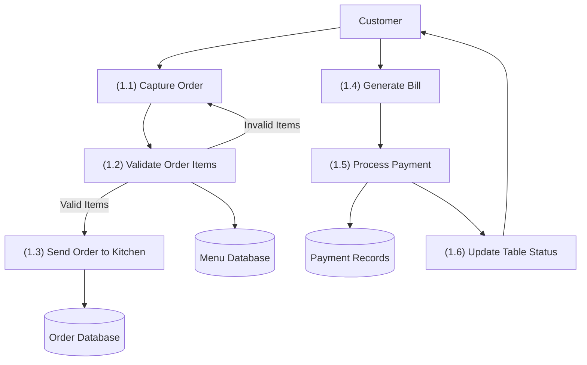

```mermaid
flowchart TD

    %% External Entity
    Customer["Customer"]

    %% Subprocesses
    A["(1.1) Capture Order"]
    B["(1.2) Validate Order Items"]
    C["(1.3) Send Order to Kitchen"]
    D["(1.4) Generate Bill"]
    E["(1.5) Process Payment"]
    F["(1.6) Update Table Status"]

    %% Data Stores
    MenuDB[("Menu Database")]
    OrderDB[("Order Database")]
    PaymentDB[("Payment Records")]

    %% Flow
    Customer --> A
    A --> B
    B -->|Valid Items| C
    B -->|Invalid Items| A

    B --> MenuDB
    C --> OrderDB

    Customer --> D
    D --> E --> PaymentDB

    E --> F
    F --> Customer
```
