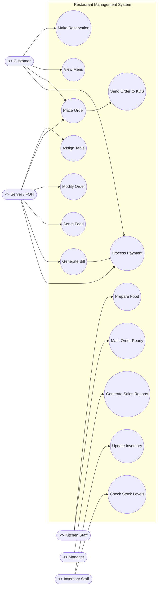

```mermaid
flowchart LR
    %% ========== ACTORS ==========
    Customer(["<<Actor>> Customer"])
    Server(["<<Actor>> Server / FOH"])
    Kitchen(["<<Actor>> Kitchen Staff"])
    Manager(["<<Actor>> Manager"])
    InventoryStaff(["<<Actor>> Inventory Staff"])

    %% ========== SYSTEM BOUNDARY ==========
    subgraph RMS["Restaurant Management System"]
        
        %% --- Reservation & Seating ---
        UC_Reserve((Make Reservation))
        UC_ViewMenu((View Menu))
        UC_AssignTable((Assign Table))

        %% --- Order Processing ---
        UC_PlaceOrder((Place Order))
        UC_ModifyOrder((Modify Order))
        UC_SendToKitchen((Send Order to KDS))

        %% --- Kitchen Processing ---
        UC_PrepFood((Prepare Food))
        UC_ReadyFood((Mark Order Ready))

        %% --- Serving & Billing ---
        UC_ServeFood((Serve Food))
        UC_GenerateBill((Generate Bill))
        UC_ProcessPayment((Process Payment))

        %% --- Inventory ---
        UC_UpdateInventory((Update Inventory))
        UC_CheckStock((Check Stock Levels))

        %% --- Reporting ---
        UC_GenerateReports((Generate Sales Reports))

        %% --- Relationships inside system ---
        UC_PlaceOrder --> UC_SendToKitchen
        UC_GenerateBill --> UC_ProcessPayment
        
    end

    %% ========== ACTOR → USE CASE LINKS ==========
    Customer --> UC_Reserve
    Customer --> UC_ViewMenu
    Customer --> UC_PlaceOrder
    Customer --> UC_ProcessPayment

    Server --> UC_AssignTable
    Server --> UC_PlaceOrder
    Server --> UC_ModifyOrder
    Server --> UC_ServeFood
    Server --> UC_GenerateBill
    Server --> UC_ProcessPayment

    Kitchen --> UC_PrepFood
    Kitchen --> UC_ReadyFood

    InventoryStaff --> UC_UpdateInventory
    InventoryStaff --> UC_CheckStock

    Manager --> UC_GenerateReports
```
