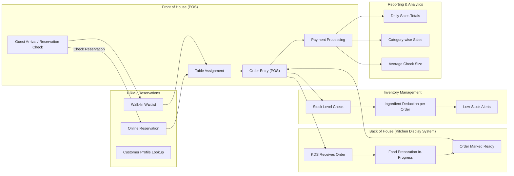

```mermaid
flowchart LR

    %% --- Core Modules ---
    subgraph FOH["Front of House (POS)"]
        A["Guest Arrival / Reservation Check"]
        B["Table Assignment"]
        C["Order Entry (POS)"]
        D["Payment Processing"]
    end

    subgraph BOH["Back of House (Kitchen Display System)"]
        E["KDS Receives Order"]
        F["Food Preparation In-Progress"]
        G["Order Marked Ready"]
    end

    subgraph INV["Inventory Management"]
        H["Stock Level Check"]
        I["Ingredient Deduction per Order"]
        J["Low-Stock Alerts"]
    end

    subgraph CRM["CRM / Reservations"]
        K["Online Reservation"]
        L["Walk-In Waitlist"]
        M["Customer Profile Lookup"]
    end

    subgraph REP["Reporting & Analytics"]
        N["Daily Sales Totals"]
        O["Category-wise Sales"]
        P["Average Check Size"]
    end

    %% --- Flow Connections ---
    A -->|Check Reservation| K
    K --> B
    A --> L
    L --> B

    B --> C
    C --> E

    %% BOH Flow
    E --> F --> G

    %% Food Ready → FOH
    G --> C

    %% Payment
    C --> D

    %% Inventory Sync
    C --> H
    H --> I --> J

    %% Reporting Triggers
    D --> N
    D --> O
    D --> P
```
