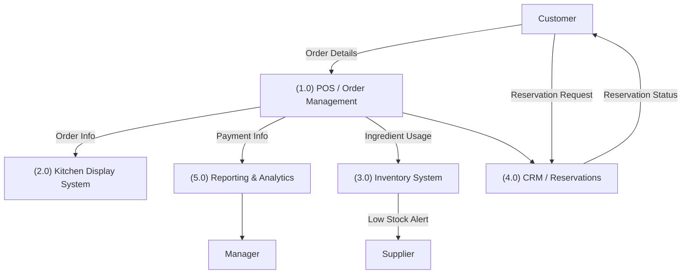

```mermaid
flowchart TD

    Customer -->|Order Details| POS["(1.0) POS / Order Management"]
    POS -->|Order Info| KDS["(2.0) Kitchen Display System"]
    POS -->|Payment Info| Reporting["(5.0) Reporting & Analytics"]

    POS -->|Ingredient Usage| Inventory["(3.0) Inventory System"]
    Inventory -->|Low Stock Alert| Supplier["Supplier"]

    Customer -->|Reservation Request| CRM["(4.0) CRM / Reservations"]
    CRM -->|Reservation Status| Customer

    POS --> CRM
    Reporting --> Manager["Manager"]
```
