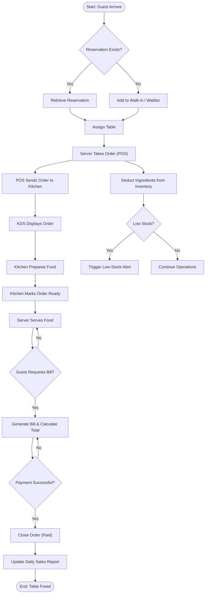

```mermaid
flowchart TD

    %% --- Start ---
    A([Start: Guest Arrives]) --> B{Reservation Exists?}

    %% --- Reservation Path ---
    B -- Yes --> C["Retrieve Reservation"]
    B -- No --> D["Add to Walk-in / Waitlist"]

    C --> E["Assign Table"]
    D --> E

    %% --- Ordering ---
    E --> F["Server Takes Order (POS)"]
    F --> G["POS Sends Order to Kitchen"]

    %% --- Kitchen Flow ---
    G --> H["KDS Displays Order"]
    H --> I["Kitchen Prepares Food"]
    I --> J["Kitchen Marks Order Ready"]

    %% --- Serving ---
    J --> K["Server Serves Food"]

    %% --- Payment Decision ---
    K --> L{Guest Requests Bill?}
    L -- No --> K
    L -- Yes --> M["Generate Bill & Calculate Total"]

    %% --- Payment Handling ---
    M --> N{Payment Successful?}
    N -- No --> M
    N -- Yes --> O["Close Order (Paid)"]

    %% --- Inventory Sync ---
    F --> P["Deduct Ingredients from Inventory"]
    P --> Q{Low Stock?}
    Q -- Yes --> R["Trigger Low-Stock Alert"]
    Q -- No --> S["Continue Operations"]

    %% --- Reporting ---
    O --> T["Update Daily Sales Report"]
    T --> U([End: Table Freed])
```
