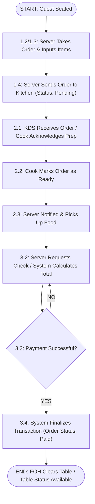

```mermaid
graph TD

    A(["START: Guest Seated"]) --> B["1.2/1.3: Server Takes Order & Inputs Items"]
    B --> C["1.4: Server Sends Order to Kitchen (Status: Pending)"]

    C --> D["2.1: KDS Receives Order / Cook Acknowledges Prep"]
    D --> E["2.2: Cook Marks Order as Ready"]
    E --> F["2.3: Server Notified & Picks Up Food"]

    F --> G["3.2: Server Requests Check / System Calculates Total"]
    G --> H{"3.3: Payment Successful?"}

    H -- YES --> I["3.4: System Finalizes Transaction (Order Status: Paid)"]
    H -- NO --> G

    I --> J(["END: FOH Clears Table / Table Status Available"])
```
